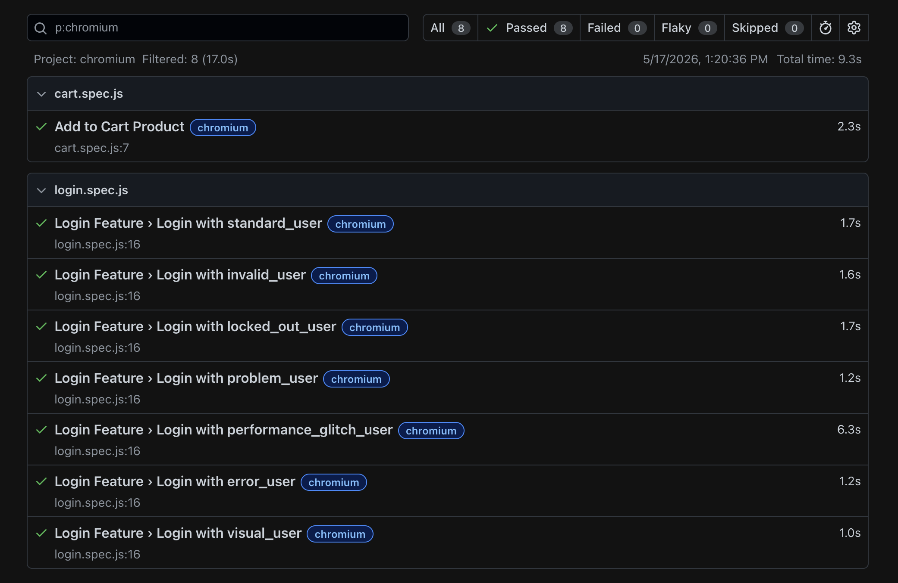

# Playwright-Automation-Web

## Setup

1. Install dependencies:
   ```bash
   npm install
   ```
2. Install Playwright 
   ```bash
   npx playwright install
   ```

## Run tests

- Run all tests:
  ```bash
  npm run test:report
  ```

## View report

- After running tests, view the HTML report:
  ```bash
  npm run test:report
  ```
  

